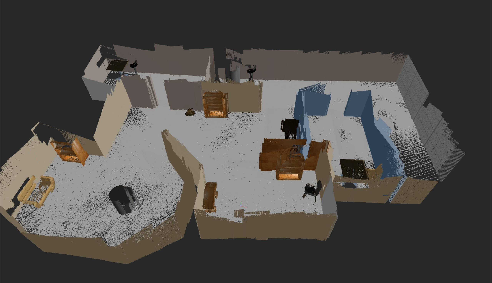
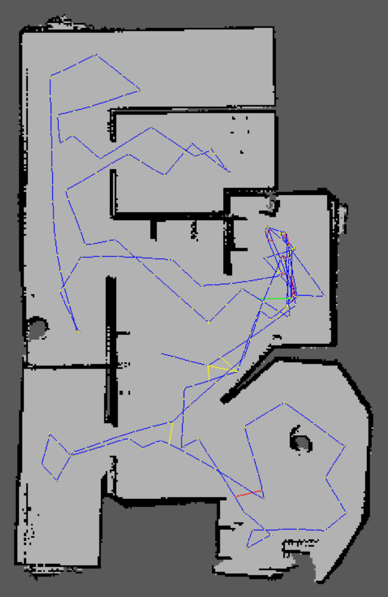
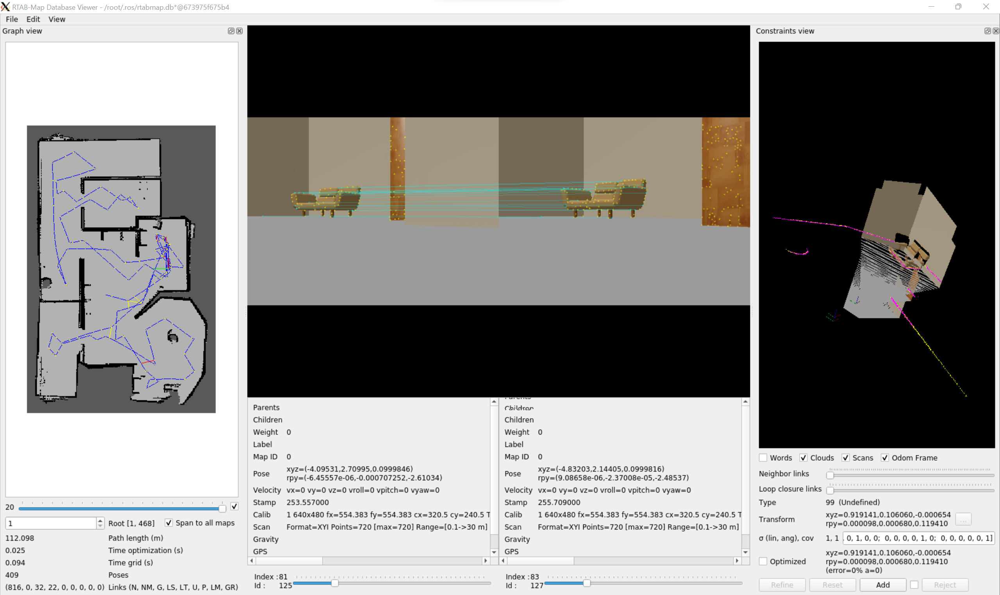

# RoboticsND-Map-My-World

Application of a Simultaneous Localization and Mapping (SLAM) algorithm inside a 
simulated environment in Gazebo with the `RTAB-Map` package.


<table style="width:100%">
  <tr>
    <th><p>
           </a>
           <br>3D Map
        </p>
    </th>
    <th><p>
           </a>
           <br>2D Map
      </p>
    </th>
  </tr>
  <tr>
    <th><p>
           </a>
           <br>Database Viewer
      </p>
    </th>
  </tr>
</table>


#### RTAB-Map

RTAB-Map (Real-Time Appearance Based Mapping) is an RGB-D Graph-SLAM method 
(that solves the Full-SLAM problem).
It uses a loop closure detector to determinate whether a new image is obtained
from a previously visited location or a new, unvisited location. When a loop 
closure hypothesis is accepted, a new constraint is added to the map’s graph and 
then a graph optimizer minimizes the errors in the map. RTAB-Map utilizes a memory 
management technique to limit the number of locations considered as candidates 
during loop closure detection, which allows it to be performed in real-time.

Note: For best performance, the features in the environment need to be 
distinguishable (not visually similar).


#### Project info

The robot uses an RGB-D camera and a LiDAR to localize itself and create a map of the environment.

The project consists of the following parts: 

* A ROS package that launches a custom robot model in a custom Gazebo world. 
The robot model was extended from the previous project 
[RoboticsND-Where-Am-I](https://github.com/elena-ecn/RoboticsND-Where-Am-I) 
and now employs an RGB-D camera.
* Interface with the ROS `RTAB-Map` package to perform SLAM.
* Teleoperation of the robot to explore and create a map of the environment.
* Database analysis to explore the generated maps, loop closures and other 
information about the mapping.


Structure
---------

There is only one package in this project.
* **my_robot**: This package holds the robot, the Gazebo world and the launch 
files to interface with the `RTAB-Map` package.

The directory structure is depicted below:
```
.RoboticsND-Map-My-World        
├── my_robot                     # my_robot package
│   ├── CMakeLists.txt           # compiler instructions
│   ├── launch
│   │   ├── localization.launch  # interface with RTAB-Map for localization with an already created map
│   │   ├── mapping.launch       # interface with RTAB-Map to create a map
│   │   ├── robot_description.launch
│   │   └── world.launch
│   ├── meshes
│   │   └── hokuyo.dae
│   ├── package.xml
│   ├── rviz
│   │   └── rvizconfig_where_am_i.rviz
│   ├── urdf
│   │   ├── my_robot.gazebo
│   │   └── my_robot.xacro
│   └── worlds
│       └── myworld_project4.world
└── images                       # simulation images
    ├── 2D_map.png
    ├── 3D_map.png
    └── rtab-map.png
```

Technologies
------------

The project was developed on Ubuntu 20.04 LTS with:
* ROS Noetic
* Gazebo 11.11.0

Dependencies
------------

The following dependencies need to be installed:
```sh
$ sudo apt-get update && sudo apt-get upgrade -y
$ sudo apt-get install ros-noetic-rtabmap-ros
$ sudo apt-get install ros-noetic-teleop-twist-keyboard
```

Installation
------------

To run this project, you must have ROS and Gazebo installed.

#### 1. Create a catkin_ws, if you do not already have one.
```sh
$ mkdir -p /catkin_ws/src/
$ cd catkin_ws/src/
$ catkin_init_workspace
```

#### 2. Clone the project in catkin_ws/src/.
```sh
$ git clone https://github.com/elena-ecn/RoboticsND-Map-My-World.git
```

#### 3. Build the packages.
```sh
$ cd /catkin_ws/
$ catkin_make
```

#### 4. Source your environment.
```sh
$ source devel/setup.bash
```

#### 5. Launch the simulation environment.
```sh
$ roslaunch my_robot world.launch
```

#### 6. Launch the `rtabmap-ros` SLAM package.
In a new terminal (Ctrl+Shift+T), run:
```sh
$ source devel/setup.bash
$ roslaunch my_robot mapping.launch
```

#### 7. Launch the `teleop` node.
In a new terminal (Ctrl+Shift+T), run:
```sh
$ source devel/setup.bash
$ rosrun teleop_twist_keyboard teleop_twist_keyboard.py
```

Teleoperate the robot through your keyboard to explore the environment. 
Once done, feel free to stop all running nodes.
The rtabmap-ros package will automatically save the created map along with the 
localized trajectory in a database file ~/.ros/rtabmap.db.


#### 8. To view the generated database, use the `rtabmap-databaseViewer` tool.
In a terminal, run:
```sh
$ rtabmap-databaseViewer ~/.ros/rtabmap.db
```

To view the relevant information:
* Select 'yes' to using the database parameters
* View -> Constraints View and Graph View

To see the 3D Map:
* Edit -> View 3D Map 


<br>

#### Localization
If you would like to perform localization with the map you created, there are some parameters that need to be changed in the `rtabmap-ros` package. So, instead of the `mapping.launch`, use:

```sh
$ roslaunch my_robot localization.launch
```

License
-------

The contents of this repository are covered under the [MIT License](LICENSE).
